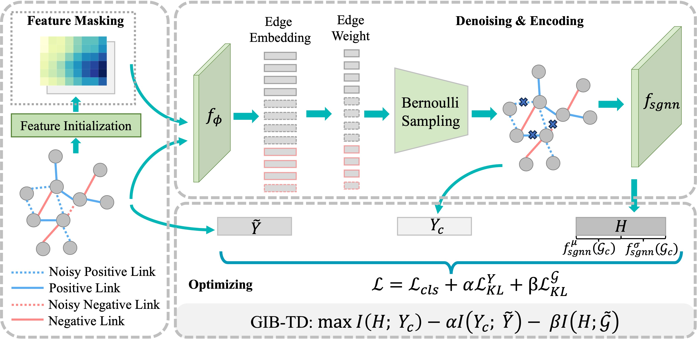

# Toward Robust Signed Graph Learning through Joint Input-Target Denoising 

<p align="middle">

</p>
    
This repository is the official PyTorch implementation of the experiments in the following paper:

[ACM MM'25](https://dl.acm.org/doi/10.1145/3746027.3755645) 

Junran Wu, Beng Chin Ooi, Ke Xu


## Dependencies
* Cuda  10.1
* python==3.8.12
* torch==1.8.2
* torch_geometric==2.0.1
* torch_geometric_signed_directed==1.0.1


## Experiments

To run the proposed model for robust link sign prediction under random noise:


```
python ridge.py
  --dataset {Bitcoin-Alpha, Bitcoin-OTC, ...}
    name of dataset
  --gnn_model {SGCN, SNEA}
    the basic signed graph encoder
  --noise_ratio {0, 0.1, 0.2, 0.25}
    the ratio of edges being flipped
  --alpha {1e-3 ~ 1e3}
    the loss coefficient of KL_Y
  --beta {1e-3 ~ 1e3}
    the loss coefficient of KL_G
```

e.g.,

```python
python ridge.py --dataset Bitcoin-Alpha --noise_ratio 0.2 --alpha 10 --beta 10
```


## Citation

If you found the provided code with our paper useful in your work, we kindly request that you cite our work. </br>

```BibTex
@inproceedings{wu2025toward,
  title={Toward Robust Signed Graph Learning through Joint Input-Target Denoising},
  author={Wu, Junran and Ooi, Beng Chin and Xu, Ke},
  booktitle={Proceedings of the 33rd ACM International Conference on Multimedia},
  pages={8721--8729},
  year={2025}
}
```
